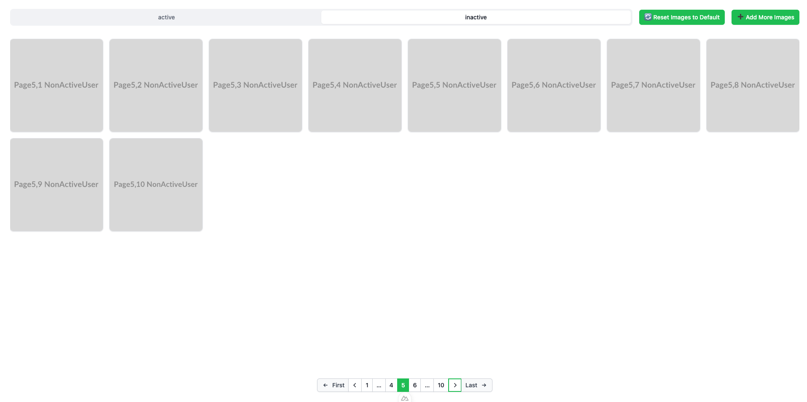

# **Nuxt 3 Full-Stack with Redis and MongoDB**

This project is a full-stack application using **Nuxt 3** for the frontend, **Redis** for caching, and **MongoDB** as the primary database. It implements **infinite scrolling pagination**, **upload functionality**, and an optimized caching strategy for performance.

## **📂 Project Structure**

```text
📦 project-root
├── docker-compose.yml       # Docker setup for frontend, MongoDB, and Redis
├── frontend/                # Nuxt 3 Frontend
│   ├── components/          # Vue components (ImageCard, ImageList, Tabs, etc.)
│   ├── composables/         # Reusable composables (useImages.ts)
│   ├── pages/               # Nuxt pages
│   ├── server/api/          # Backend API (generate.ts, images.ts, etc.)
│   ├── server/utils/        # MongoDB and Redis utilities
│   ├── nuxt.config.ts       # Nuxt configuration
│   ├── dockerfile           # Docker configuration for frontend
│   ├── package.json         # Dependencies
│   └── tsconfig.json        # TypeScript configuration
```

## **🚀 How to Use**



### **1️⃣ Setup & Run the Project**

```sh
# Clone the repository
git clone <repo_url>
cd project-root

# Install dependencies
npm install

# Start MongoDB, Redis, and Frontend via Docker
docker-compose up -d

# Start Nuxt 3 in development mode
npm run dev
```

### **2️⃣ Upload an Image**

- Use the **Upload Button** on the frontend to upload images.
- Uploaded images are **stored in MongoDB** and **cached in Redis** if applicable.

### **3️⃣ Fetch Images with Infinite Scrolling**

- **Active Users (`active=true`)** use **Redis cache**.
- **Non-Active Users (`active=false`)** **always** fetch from MongoDB.
- Pagination loads **50 images per request**.

### **4️⃣ Generate Heavy Data** (For Performance Testing)

```sh
curl -X POST "http://localhost:3000/api/generate-heavy"
```

- Generates **a large dataset** in MongoDB for testing.

## **⚡ Cache Strategy & Mechanism (Page & Active)**

### **1️⃣ Active Users (`active=true`)**

✅ **Cached in Redis** (No expiration) for faster response times
✅ **Prefetches `n-1` and `n+1` pages**.
✅ **If cache is stale, fetch from MongoDB and update Redis**.

### **2️⃣ Non-Active Users (`active=false`)**

❌ **Not cached in Redis**.

❌ **Every request fetches from MongoDB**.

❌ **Slower but ensures fresh data for testing performance.**

### **3️⃣ Cache Expiration & Management**

🕒 **Redis entries for `active=true` do not expire automatically**.

🕒 **Redis cache is cleared when heavy data is generated**.

🕒 **Manual refresh is possible via `?refresh=true` in API calls**.

## **📌 API Endpoints**

| **Endpoint**                     | **Method** | **Description** |
|----------------------------------|-----------|----------------|
| `/api/generate`                  | `POST`    | Resets images and generates 200 new images (100 ActiveUser + 100 NonActiveUser) |
| `/api/images?page=1&active=true` | `GET`     | Fetches images with pagination. Uses Redis cache for active users. |
| `/api/generate-heavy`            | `POST`    | Generates 100,000 images in MongoDB and clears Redis cache. |

### **1️⃣ Rest Images and Generate**

```sh
POST /api/generate
```

**Response:**

```json
{
  "images": [{"_id": "abc123", "url": "/uploads/image1.png"}],
  "message": "✅ Generated 200 images (100 ActiveUser + 100 NonActiveUser)"
}
```

### **2️⃣ Fetch Images (With Cache for Active Users)**

```sh
GET /api/images?page=1&active=true
```

**Query Params:**

- `page` → Page number (e.g., `1, 2, 3...`)
- `active` → Whether the user is active (`true` = Cached, `false` = No Cache)
- `refresh` → If `true`, forces cache refresh.

**Response:**

```json
{
  "status": "cache",
  "statusMessage": "Loaded from Redis cache",
  "images": [{"_id": "abc123", "url": "/uploads/image1.png"}]
}
```

### **3️⃣ Generate Large Dataset**

```sh
POST /api/generate-heavy
```

- Generates **100,000 images** in MongoDB.
- Clears Redis cache to ensure fresh dataset is used.

**Response:**

```json
{
  "status": "success",
  "statusMessage": "✅ Generated 100,000 images and cleared cache"
}
```

## **🚀 Final Thoughts**

This project optimizes **performance with Redis caching**, supports **infinite scrolling pagination**, and **efficiently fetches & generates images** in MongoDB.

🎯 **Next Steps:**

- Implement **unit tests (Cypress, Jest)** to benchmark caching vs. non-caching.
- Add **bulk image upload support**.
- Improve **Redis eviction strategies** to keep memory usage optimized
